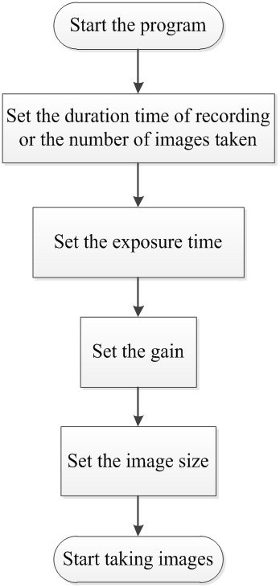
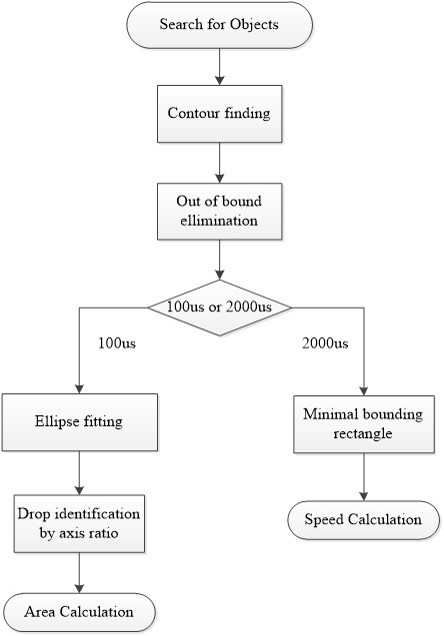
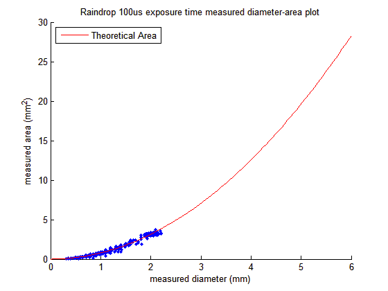

# An Image-based Disdrometer Verification and Raindrop Analysis
NTHU Electrical Engineering Department Master Thesis 
[MasterThesis.pdf](https://drive.google.com/open?id=0B_MhQboJITZGYkNiaTJ2TGIxNFE) 
[Thesis Presentation](https://drive.google.com/open?id=1G2IBdKJv1o6My_c9Q-7HreBVWdl7P4TtB7kLHedC7mY) 

## Introduction
It is believed that the behavior of rainfall phenomena are due to local and sudden precipitation. By predicting the rainfall intensity, some advance preparation can be done to prevent from potential threats like landslides and floods. To analyze the precipitation in a small area, measuring raindrops is an effective way.

A disdrometer is an instrument used to measure the drop size and velocity distribution. The velocity of raindrops can be measured and then verified by the terminal velocity, which has an empirical relationship with the drop diameter. These features are vital to analyze the condition of precipitation.

## System Structure

	

The system can be separated into 4 parts. The optical unit includes Part A, which is the light source; the image acquisition unit contains Part B and Part C, which are lens and camera respectively; the last part is the data processing unit, which is labeled as Part D. The space between the optical unit and the acquisition unit is the target space of our experiment.

### Light Source
We use a blue LED light source  *Viswell HBL-100* to enhance the luminance of the environment. Since the camera is taking pictures under low exposure time, it needs additional illuminance to make enough contrast between the raindrops and the background.

	

### Camera
A CCD camera *Pylon Basler Aca640-90gm* is used to capture raindrops, which should be capable of working in high frame rate and different exposure time.
#### Pylon Basler Aca640-90gm

	

* Monochrome
* Adjustable gain and exposure time
* High frame rate (Stable 90 fps)
* 659 px * 494 px
* SDK Provided

### Lens
We used a telecentric lens *OPTO Engineering TC13064* on the front of the camera. Because we want to reduce the blurriness as much as possible, the characteristic of a telecentric lens can give us the result to meet the needs.
#### OPTO Engineering TC13064

	

* Telecentric Lens — Minimize Blur Effect
* FOV — 6.5cm*4.8cm
* DoF — ~15cm
* Fixed Focus
* Fixed Iris

## Workflow
### Camera Parameter Setting

	

### Image Preprocessing

	

### Drop Extraction and Analysis

	

## Result
* Captured Image in Low Exposure Time (100us)

	

* Processed Image

	

* Captured Image in High Exposure Time (2000us)

	

*  Processed Image

	

* Result Graph

	
	

